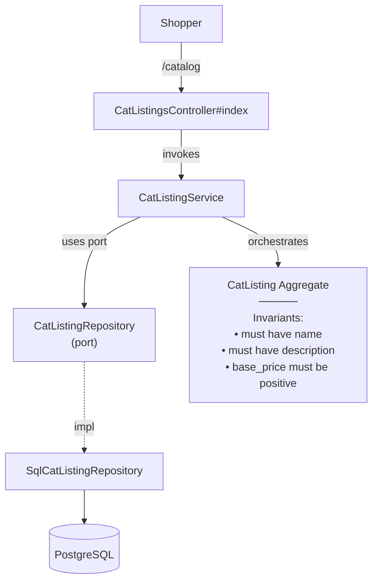

# BrowseCatalog — Capability Spec

**Bounded Context:** Cat & Content
**Status:** implemented
**Generated:** 2025-12-23T01:51:59.650Z
**Source:** `/Users/pcaplan/paul/cats-as-a-service/architecture/cat_content/architecture.json`

<!-- 
Status values:
  - template: Initial generated template, not yet planned
  - planned: Specs completed via /rampart.plan, ready for implementation
  - implemented: Code implementation complete
Update this status as you progress through the workflow.
-->

---

## Overview

**Actors:** Shopper
**Entrypoints:** CatListingsController#index, CatListingsController#show
**Outputs:** CatListing

---

## Acceptance Criteria

<!-- Use EARS notation for testable requirements -->

### Index (Browse Catalog)

- [x] WHEN a shopper navigates to /api/catalog THE SYSTEM SHALL return a list of published CatListings
- [x] WHILE displaying the catalog THE SYSTEM SHALL show each listing's id, name, slug, description, image, price, and tags
- [x] WHILE displaying the catalog THE SYSTEM SHALL only include CatListings with visibility = 'published'
- [x] WHILE displaying the catalog THE SYSTEM SHALL include a count of total listings returned
- [x] WHEN no published CatListings exist THE SYSTEM SHALL return an empty list with count = 0

### Show (View Single Listing)

- [x] WHEN a shopper navigates to /api/catalog/:slug THE SYSTEM SHALL return the full CatListing details
- [x] WHILE displaying a single listing THE SYSTEM SHALL show: id, name, slug, full description, image (url + alt), price, and tags
- [x] WHERE price is formatted as USD currency (e.g., "$48.00")
- [x] WHERE visibility mapping: private = draft, published = published, archived = archived

---

## Error Handling

<!-- Define error scenarios using EARS IF/THEN notation -->

- [x] IF the requested slug does not exist THEN THE SYSTEM SHALL return 404 Not Found with error body
- [x] IF the requested CatListing has visibility != 'published' THEN THE SYSTEM SHALL return 404 Not Found
- [x] IF the database is unavailable THEN THE SYSTEM SHALL return 503 Service Unavailable with a retry-friendly message

---

## Domain State & Data

### Aggregates involved

#### CatListing
> Premade, curated, globally visible cat in the Cat-alog; root for catalog browsing

**Key Attributes:**
- `id`
- `name`
- `description`
- `image_url`
- `base_price`

**Invariants:**
- must have name
- must have description
- base_price must be positive

**Lifecycle:** draft -> published -> archived

---

## Data Model

<!-- Map the Aggregate attributes above to a persistence schema -->
<!-- Note: Only model tables owned by this Bounded Context -->

### Schema

| Table | Column | Type | Constraints |
|-------|--------|------|-------------|
| cat_content.cat_listings | id | UUID | PK, DEFAULT gen_random_uuid() |
| | name | VARCHAR(100) | NOT NULL |
| | slug | VARCHAR(100) | NOT NULL, UNIQUE |
| | description | TEXT | NOT NULL |
| | price_cents | INTEGER | NOT NULL |
| | currency | VARCHAR(3) | DEFAULT 'USD' |
| | visibility | VARCHAR(20) | NOT NULL, DEFAULT 'private' |
| | image_url | TEXT | |
| | image_alt | TEXT | |
| | tags | TEXT[] | DEFAULT '{}' |
| | created_at | TIMESTAMP | DEFAULT CURRENT_TIMESTAMP |
| | updated_at | TIMESTAMP | DEFAULT CURRENT_TIMESTAMP |

### Visibility Values (Lifecycle Mapping)

| visibility | Domain Lifecycle | Description |
|------------|------------------|-------------|
| private | draft | Not visible to shoppers |
| published | published | Visible in catalog |
| archived | archived | Hidden, retained for historical orders |

### Relationships

- None within this bounded context (CatListing is the root aggregate)
- Future: Commerce BC will reference `cat_listings.id` by value (no FK across BC boundaries)

### Indexes

| Index | Columns | Type | Purpose |
|-------|---------|------|---------|
| idx_cat_listings_visibility | visibility | B-tree | Filter published listings |
| idx_cat_listings_slug | slug | B-tree | Fast lookup by slug |
| idx_cat_listings_tags | tags | GIN | Future tag filtering |

---

## Request/Response Contracts

<!-- Define API payloads and Event DTOs -->

### GET /api/catalog (Index)

**Request:**

No request body. No query parameters for MVP.

**Response (200 OK):**

```json
{
  "listings": [
    {
      "id": "550e8400-e29b-41d4-a716-446655440000",
      "name": "Nebula Neko",
      "slug": "nebula-neko",
      "description": "Softly glows in the dark and purrs in minor keys...",
      "price": {
        "cents": 4800,
        "currency": "USD",
        "formatted": "$48.00"
      },
      "image": {
        "url": "https://example.com/nebula-neko.jpg",
        "alt": "Nebula Neko illustration"
      },
      "tags": ["cozy", "cosmic"]
    }
  ],
  "count": 6
}
```

### GET /api/catalog/:slug (Show)

**Request:**

No request body. Slug provided in URL path.

**Response (200 OK):**

```json
{
  "id": "550e8400-e29b-41d4-a716-446655440000",
  "name": "Nebula Neko",
  "slug": "nebula-neko",
  "description": "Softly glows in the dark and purrs in minor keys whenever a comet passes within 3 light-years. Prefers quiet evenings and existential conversations about the void.",
  "price": {
    "cents": 4800,
    "currency": "USD",
    "formatted": "$48.00"
  },
  "image": {
    "url": "https://example.com/nebula-neko.jpg",
    "alt": "Nebula Neko illustration"
  },
  "tags": ["cozy", "cosmic"]
}
```

**Response (404 Not Found):**

```json
{
  "error": "not_found",
  "message": "Cat listing not found"
}
```

**Response (503 Service Unavailable):**

```json
{
  "error": "service_unavailable",
  "message": "Unable to retrieve catalog. Please try again shortly."
}
```

---

## Architecture

### Capability Flow Diagram



### Application Layer

**Services:**
- CatListingService

### Domain Layer

**Aggregate:** CatListing

**Invariants:**
- must have name
- must have description
- base_price must be positive

**Lifecycle:** draft → published → archived

### Infrastructure Layer

**Ports Used:**
- CatListingRepository

**Adapters:**
- SqlCatListingRepository → CatListingRepository

---

## Implementation Notes (Optional)

- **Price storage:** Store price in cents (`price_cents`) to avoid floating-point issues. Format as USD in response DTOs.
- **Visibility filter:** All queries must filter by `visibility = 'published'` to ensure draft/archived cats are never exposed.
- **Tags display:** Tags are stored as a PostgreSQL TEXT array and returned as-is to the frontend for display (e.g., "cozy", "cosmic" → "Cozy cosmic").
- **Slug uniqueness:** Slugs are unique and URL-safe. Use for public URLs instead of exposing UUIDs.

---

## ✅ Post-Implementation Checklist

Once implementation is complete:

- [x] All acceptance criteria pass
- [x] Error handling scenarios covered by tests
- [x] Update **Status** field at top of this file from `planned` to `implemented`
