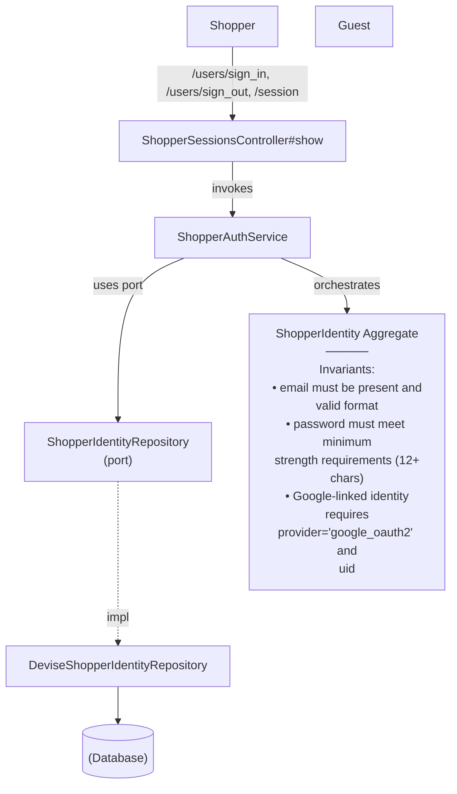

# GetShopperSession — Capability Spec

**Bounded Context:** Identity & Profile
**Status:** template
**Generated:** 2025-12-28T03:09:05.692Z
**Source:** `/Users/pcaplan/paul/cats-as-a-service/architecture/identity/architecture.json`

<!-- 
Status values:
  - template: Initial generated template, not yet planned
  - planned: Specs completed via /rampart.plan, ready for implementation
  - implemented: Code implementation complete
Update this status as you progress through the workflow.
-->

---

## Overview

Return current authentication state and minimal profile for the Vercel frontend

**Actors:** Shopper, Guest
**Entrypoints:** ShopperSessionsController#show
**Outputs:** ShopperIdentity

---

## Acceptance Criteria

<!-- Use EARS notation for testable requirements -->
<!-- WHEN <trigger> THE SYSTEM SHALL <response> -->
<!-- WHILE <state> THE SYSTEM SHALL <response> -->
<!-- IF <condition> THEN THE SYSTEM SHALL <response> -->

- [ ] WHEN ... THE SYSTEM SHALL ...
- [ ] WHEN ... THE SYSTEM SHALL ...
- [ ] WHEN ... THE SYSTEM SHALL ...

---

## Error Handling

<!-- Define error scenarios using EARS IF/THEN notation -->

- [ ] IF ... THEN THE SYSTEM SHALL ...
- [ ] IF ... THEN THE SYSTEM SHALL ...

---

## Domain State & Data

### Aggregates involved

_No specific aggregates identified in architecture._

---

## Data Model

<!-- Map the Aggregate attributes above to a persistence schema -->
<!-- Note: Only model tables owned by this Bounded Context -->

### Schema

| Table | Column | Type | Constraints |
|-------|--------|------|-------------|
| ...   | ...    | ...  | ...         |

### Relationships

<!-- Define foreign keys, join tables, and cross-aggregate references -->

### Indexes

<!-- Define indexes for query optimization -->

---

## Request/Response Contracts

<!-- Define API payloads and Event DTOs -->
<!-- Tip: Use Task-Based naming (e.g. GenerateCustomCatRequest) -->

### Request

```json
{
  ...
}
```

### Response

```json
{
  ...
}
```

---

## Architecture

### Capability Flow Diagram



### Application Layer

**Services:**
- ShopperAuthService

### Domain Layer

**Aggregate:** ShopperIdentity

**Invariants:**
- email must be present and valid format
- password must meet minimum strength requirements (12+ chars)
- Google-linked identity requires provider='google_oauth2' and uid

**Lifecycle:** active → suspended

### Infrastructure Layer

**Ports Used:**
- ShopperIdentityRepository

**Adapters:**
- DeviseShopperIdentityRepository → ShopperIdentityRepository

---

## Implementation Notes (Optional)

<!-- Add any implementation-specific notes, constraints, or considerations -->

---

## ✅ Post-Implementation Checklist

Once implementation is complete:

- [ ] All acceptance criteria pass
- [ ] Error handling scenarios covered by tests
- [ ] Update **Status** field at top of this file from `planned` to `implemented`
