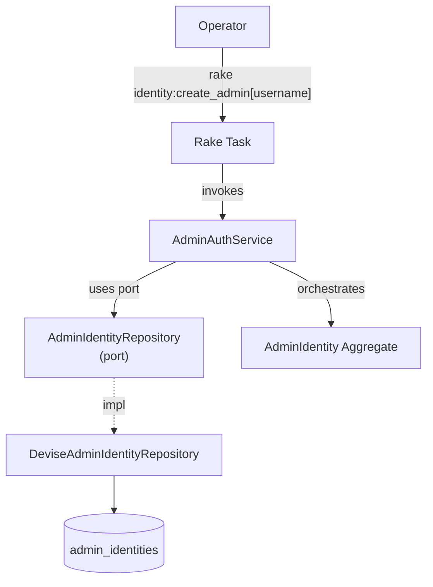

# ProvisionAdmin — Capability Spec

**Bounded Context:** Identity & Profile
**Status:** planned
**Generated:** 2025-12-28T03:09:05.693Z
**Source:** `/Users/pcaplan/paul/cats-as-a-service/architecture/identity/architecture.json`

<!-- 
Status values:
  - template: Initial generated template, not yet planned
  - planned: Specs completed via /rampart.plan, ready for implementation
  - implemented: Code implementation complete
Update this status as you progress through the workflow.
-->

---

## Overview

Create a new admin account via server-side script; not exposed via web endpoints

**Actors:** Operator
**Entrypoints:** rake identity:create_admin, rails runner
**Outputs:** AdminIdentity

---

## Acceptance Criteria

<!-- Use EARS notation for testable requirements -->

### Happy Path

- [ ] WHEN an operator runs `rake identity:create_admin[username]` THE SYSTEM SHALL create a new AdminIdentity
- [ ] WHEN creating an admin THE SYSTEM SHALL generate a secure random password (24+ chars)
- [ ] WHEN creation succeeds THE SYSTEM SHALL print the username and generated password to stdout
- [ ] WHEN creation succeeds THE SYSTEM SHALL set status='active'

### Validation Rules

- [ ] WHERE username must be present
- [ ] WHERE username must be unique (case-sensitive)
- [ ] WHERE generated password must be at least 24 characters with mixed case, numbers, and symbols

---

## Error Handling

<!-- Define error scenarios using EARS IF/THEN notation -->

### Validation Errors

- [ ] IF username is not provided THEN THE SYSTEM SHALL exit with error "Username is required"
- [ ] IF username already exists THEN THE SYSTEM SHALL exit with error "Username 'X' already exists"

### System Errors

- [ ] IF database connection fails THEN THE SYSTEM SHALL exit with error and non-zero exit code

---

## Domain State & Data

### Aggregates involved

**Aggregate:** AdminIdentity

**Key Attributes:** id, username, encrypted_password, status

**Invariants:**
- username must be present and unique
- password must meet minimum strength requirements (12+ chars)
- can only be created via server-side script

**Lifecycle:** active → locked

---

## Data Model

<!-- Map the Aggregate attributes above to a persistence schema -->
<!-- Note: Only model tables owned by this Bounded Context -->

### Schema

*Same schema as SignInAdmin spec:*

| Table | Column | Type | Constraints |
|-------|--------|------|-------------|
| admin_identities | id | uuid | PRIMARY KEY, DEFAULT gen_random_uuid() |
| admin_identities | username | string(100) | NOT NULL, UNIQUE |
| admin_identities | encrypted_password | string(255) | NOT NULL |
| admin_identities | status | string(20) | NOT NULL, DEFAULT 'active' |
| admin_identities | failed_attempts | integer | NOT NULL, DEFAULT 0 |
| admin_identities | locked_at | timestamp | NULL |
| admin_identities | created_at | timestamp | NOT NULL |
| admin_identities | updated_at | timestamp | NOT NULL |

### Relationships

None — AdminIdentity is a standalone aggregate.

### Indexes

| Index Name | Columns | Type | Purpose |
|------------|---------|------|---------|
| index_admin_identities_on_username | username | UNIQUE | Enforce uniqueness |

---

## Request/Response Contracts

<!-- Define API payloads and Event DTOs -->

### Entrypoint

**Rake Task:** `rake identity:create_admin[username]`

### Input

```bash
# Via rake task
rake identity:create_admin[superadmin]

# Via rails runner (alternative)
rails runner "AdminAuthService.provision_admin('superadmin')"
```

| Argument | Type | Required | Notes |
|----------|------|----------|-------|
| username | string | Yes | Unique admin username |

### Success Output

```
Admin created successfully!
━━━━━━━━━━━━━━━━━━━━━━━━━━━━━━
Username: superadmin
Password: Xk9#mPq2$vL8nR4@wY6zT3!hJ
━━━━━━━━━━━━━━━━━━━━━━━━━━━━━━

⚠️  Save this password securely. It cannot be recovered.
```

*Exit code: 0*

### Error Output

```
Error: Username 'superadmin' already exists
```

*Exit code: 1*

---

## Architecture

### Capability Flow Diagram



### Application Layer

**Services:**
- AdminAuthService

### Domain Layer

**Aggregate:** AdminIdentity

**Invariants:**
- username must be present and unique
- password must meet minimum strength requirements (12+ chars)
- can only be created via server-side script

**Lifecycle:** active → locked

### Infrastructure Layer

**Ports Used:**
- AdminIdentityRepository

**Adapters:**
- DeviseAdminIdentityRepository → AdminIdentityRepository

---

## Implementation Notes

### Rake Task Definition

```ruby
# lib/tasks/identity.rake
namespace :identity do
  desc "Create a new admin account"
  task :create_admin, [:username] => :environment do |t, args|
    username = args[:username]
    
    if username.blank?
      abort "Error: Username is required"
    end
    
    result = AdminAuthService.new.provision_admin(username)
    
    if result.success?
      puts "Admin created successfully!"
      puts "━" * 30
      puts "Username: #{result.value.username}"
      puts "Password: #{result.value.password}"
      puts "━" * 30
      puts ""
      puts "⚠️  Save this password securely. It cannot be recovered."
    else
      abort "Error: #{result.error}"
    end
  end
end
```

### Service Implementation

```ruby
# AdminAuthService#provision_admin
def provision_admin(username)
  return Result.failure("Username '#{username}' already exists") if repository.exists?(username)
  
  password = SecureRandom.base64(32).tr('+/', '-_')[0..23] # 24 chars
  # Add special chars for complexity
  password = password + "!@#$%"[rand(5)]
  
  admin = repository.create(
    username: username,
    password: password,
    status: 'active'
  )
  
  # Return both admin and plaintext password (only time it's available)
  Result.success(OpenStruct.new(username: admin.username, password: password))
end
```

### Password Generation

- Use `SecureRandom` for cryptographically secure generation
- Minimum 24 characters
- Include mixed case, numbers, and at least one symbol
- Password is only displayed once; cannot be recovered

### Security Considerations

- Task runs server-side only (no web exposure)
- Password printed to stdout for operator to capture
- Consider logging admin creation (without password) for audit
- Operator should immediately change password or store securely

### No Web Registration

The invariant "can only be created via server-side script" is enforced by:
- No `AdminRegistrationsController` exists
- No route to `POST /admin_users`
- Only this rake task can create AdminIdentity records

### Hexagonal Mapping

| Rampart Layer | Implementation |
|---------------|----------------|
| Entrypoint | `rake identity:create_admin` |
| Service | `AdminAuthService#provision_admin` |
| Repository Port | `AdminIdentityRepository` |
| Repository Adapter | `DeviseAdminIdentityRepository` |
| Aggregate | `AdminIdentity` (Devise model) |

---

## ✅ Post-Implementation Checklist

Once implementation is complete:

- [ ] All acceptance criteria pass
- [ ] Error handling scenarios covered by tests
- [ ] Update **Status** field at top of this file from `planned` to `implemented`
