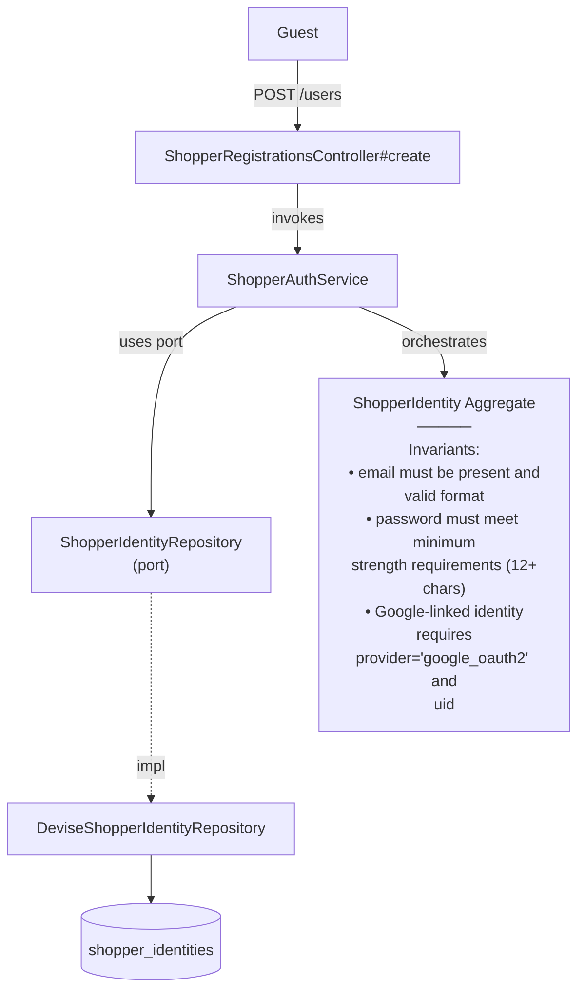

# RegisterShopper — Capability Spec

**Bounded Context:** Identity & Profile
**Status:** planned
**Generated:** 2025-12-28T03:09:05.691Z
**Source:** `/Users/pcaplan/paul/cats-as-a-service/architecture/identity/architecture.json`

<!-- 
Status values:
  - template: Initial generated template, not yet planned
  - planned: Specs completed via /rampart.plan, ready for implementation
  - implemented: Code implementation complete
Update this status as you progress through the workflow.
-->

---

## Overview

Create a new shopper account with email and password

**Actors:** Guest
**Entrypoints:** ShopperRegistrationsController#create
**Outputs:** ShopperIdentity

---

## Acceptance Criteria

<!-- Use EARS notation for testable requirements -->

### Happy Path

- [ ] WHEN a guest submits valid registration data (email, password, password_confirmation, name) THE SYSTEM SHALL create a new ShopperIdentity via ShopperIdentityRepository
- [ ] WHEN registration succeeds THE SYSTEM SHALL automatically sign in the shopper (establish session)
- [ ] WHEN registration succeeds THE SYSTEM SHALL return the created ShopperIdentity

### Validation Rules

- [ ] WHERE email must be present and valid format (Devise default validation)
- [ ] WHERE email must be unique (case-insensitive)
- [ ] WHERE password must be at least 12 characters
- [ ] WHERE password_confirmation must match password
- [ ] WHERE name must be present and between 1-100 characters

---

## Error Handling

<!-- Define error scenarios using EARS IF/THEN notation -->

### Validation Errors

- [ ] IF email is missing or invalid format THEN THE SYSTEM SHALL reject with error "Email is invalid"
- [ ] IF email already exists THEN THE SYSTEM SHALL reject with error "Email has already been taken"
- [ ] IF password is missing THEN THE SYSTEM SHALL reject with error "Password can't be blank"
- [ ] IF password is less than 12 characters THEN THE SYSTEM SHALL reject with error "Password is too short (minimum is 12 characters)"
- [ ] IF password_confirmation does not match password THEN THE SYSTEM SHALL reject with error "Password confirmation doesn't match Password"
- [ ] IF name is missing THEN THE SYSTEM SHALL reject with error "Name can't be blank"
- [ ] IF name exceeds 100 characters THEN THE SYSTEM SHALL reject with error "Name is too long (maximum is 100 characters)"

### Rate Limiting

- [ ] IF a client exceeds 5 registration attempts per minute THEN THE SYSTEM SHALL reject with HTTP 429 and error "Too many requests. Please try again later."

---

## Domain State & Data

### Aggregates involved

**Aggregate:** ShopperIdentity

**Key Attributes:** id, email, encrypted_password, name, provider, uid, email_verified, status

**Invariants:**
- email must be present and valid format
- password must meet minimum strength requirements (12+ chars)
- Google-linked identity requires provider='google_oauth2' and uid

**Lifecycle:** active → suspended

---

## Data Model

<!-- Map the Aggregate attributes above to a persistence schema -->
<!-- Note: Only model tables owned by this Bounded Context -->

### Schema

| Table | Column | Type | Constraints |
|-------|--------|------|-------------|
| shopper_identities | id | uuid | PRIMARY KEY, DEFAULT gen_random_uuid() |
| shopper_identities | email | string(255) | NOT NULL, UNIQUE (case-insensitive) |
| shopper_identities | encrypted_password | string(255) | NOT NULL |
| shopper_identities | name | string(100) | NOT NULL |
| shopper_identities | provider | string(50) | NULL (for OAuth) |
| shopper_identities | uid | string(255) | NULL (for OAuth) |
| shopper_identities | email_verified | boolean | NOT NULL, DEFAULT false |
| shopper_identities | status | string(20) | NOT NULL, DEFAULT 'active' |
| shopper_identities | created_at | timestamp | NOT NULL |
| shopper_identities | updated_at | timestamp | NOT NULL |

### Relationships

None — ShopperIdentity is a standalone aggregate. Other bounded contexts reference by `id` only.

### Indexes

| Index Name | Columns | Type | Purpose |
|------------|---------|------|---------|
| index_shopper_identities_on_email | email | UNIQUE | Enforce uniqueness, fast lookup by email |
| index_shopper_identities_on_provider_and_uid | provider, uid | UNIQUE (where provider IS NOT NULL) | OAuth identity lookup |

### Enums

| Column | Values | Notes |
|--------|--------|-------|
| status | active, suspended | Lifecycle states |
| provider | google_oauth2, NULL | OAuth provider (NULL for password-only) |

---

## Request/Response Contracts

<!-- Define API payloads and Event DTOs -->

### Entrypoint

**POST /users**

### Request

```json
{
  "user": {
    "email": "shopper@example.com",
    "password": "securepassword123",
    "password_confirmation": "securepassword123",
    "name": "Jane Doe"
  }
}
```

| Field | Type | Required | Validation |
|-------|------|----------|------------|
| email | string | Yes | Valid email format, unique |
| password | string | Yes | Min 12 characters |
| password_confirmation | string | Yes | Must match password |
| name | string | Yes | 1-100 characters |

### Success Response

**HTTP 201 Created**

```json
{
  "id": "550e8400-e29b-41d4-a716-446655440000",
  "email": "shopper@example.com",
  "name": "Jane Doe",
  "email_verified": false,
  "created_at": "2025-12-28T12:00:00Z"
}
```

*Note: Session cookie is set automatically by Devise.*

### Error Response

**HTTP 422 Unprocessable Entity**

```json
{
  "errors": {
    "email": ["has already been taken"],
    "password": ["is too short (minimum is 12 characters)"]
  }
}
```

**HTTP 429 Too Many Requests**

```json
{
  "error": "Too many requests. Please try again later."
}
```

---

## Architecture

### Capability Flow Diagram



### Application Layer

**Services:**
- ShopperAuthService

### Domain Layer

**Aggregate:** ShopperIdentity

**Invariants:**
- email must be present and valid format
- password must meet minimum strength requirements (12+ chars)
- Google-linked identity requires provider='google_oauth2' and uid

**Lifecycle:** active → suspended

### Infrastructure Layer

**Ports Used:**
- ShopperIdentityRepository

**Adapters:**
- DeviseShopperIdentityRepository → ShopperIdentityRepository

---

## Implementation Notes

### Devise Configuration

- Use Devise modules: `:database_authenticatable`, `:registerable`, `:validatable`
- Do NOT enable `:confirmable` (no email verification for MVP)
- Override `Devise::RegistrationsController` with `ShopperRegistrationsController`
- Add `name` to permitted params via `configure_permitted_parameters`

### Password Policy

- Devise default `:validatable` enforces 6-char minimum; override to 12 chars via `config.password_length = 12..128`

### Rate Limiting

- Use Rack::Attack or similar middleware
- Throttle by IP: 5 requests/minute to `POST /users`

### Hexagonal Mapping

| Rampart Layer | Implementation |
|---------------|----------------|
| Controller | `ShopperRegistrationsController` (inherits Devise) |
| Service | `ShopperAuthService` (thin wrapper, mostly delegates to Devise) |
| Repository Port | `ShopperIdentityRepository` |
| Repository Adapter | `DeviseShopperIdentityRepository` (wraps Devise model) |
| Aggregate | `ShopperIdentity` (Devise model with validations) |

### Keeping It Simple

Since we're leaning on Devise:
- The `ShopperAuthService` can be a thin pass-through that calls the repository
- The `DeviseShopperIdentityRepository` wraps `ShopperIdentity.create!` and translates to/from domain objects
- Most validation lives in the Devise model (`:validatable` + custom `name` validation)
- Controller inherits from `Devise::RegistrationsController` and overrides `create` to return JSON

---

## ✅ Post-Implementation Checklist

Once implementation is complete:

- [ ] All acceptance criteria pass
- [ ] Error handling scenarios covered by tests
- [ ] Update **Status** field at top of this file from `planned` to `implemented`
