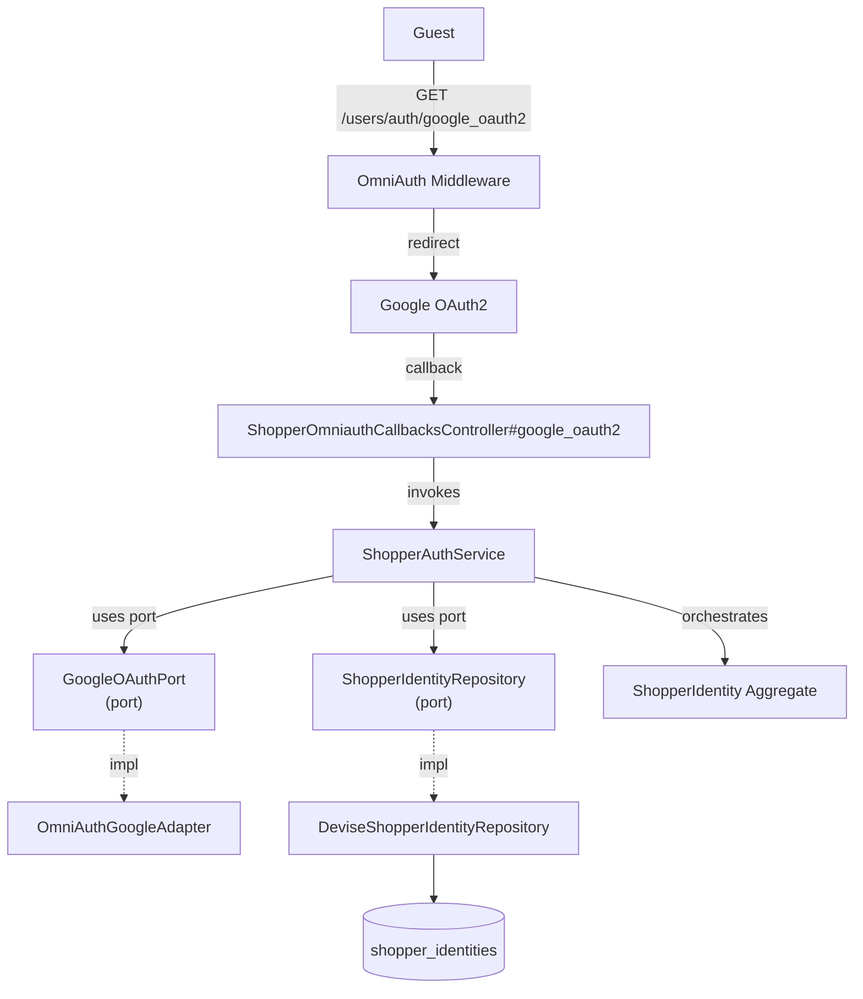

# SignInShopperWithGoogle — Capability Spec

**Bounded Context:** Identity & Profile
**Status:** planned
**Generated:** 2025-12-28T03:09:05.692Z
**Source:** `/Users/pcaplan/paul/cats-as-a-service/architecture/identity/architecture.json`

<!-- 
Status values:
  - template: Initial generated template, not yet planned
  - planned: Specs completed via /rampart.plan, ready for implementation
  - implemented: Code implementation complete
Update this status as you progress through the workflow.
-->

---

## Overview

Authenticate a shopper via Google OAuth; creates or links account automatically

**Actors:** Guest
**Entrypoints:** ShopperOmniauthCallbacksController#google_oauth2
**Outputs:** ShopperIdentity

---

## Acceptance Criteria

<!-- Use EARS notation for testable requirements -->

### Happy Path — Existing Google-Linked Account

- [ ] WHEN a guest completes Google OAuth and the uid+provider already exists THE SYSTEM SHALL authenticate the existing ShopperIdentity
- [ ] WHEN authentication succeeds THE SYSTEM SHALL establish a session (set session cookie)
- [ ] WHEN authentication succeeds THE SYSTEM SHALL return the authenticated ShopperIdentity

### Auto-Link — Email Exists with Password Only

- [ ] WHEN a guest completes Google OAuth and the email exists but has no Google link THE SYSTEM SHALL link Google credentials (provider, uid) to the existing ShopperIdentity
- [ ] WHEN linking succeeds THE SYSTEM SHALL establish a session
- [ ] WHEN linking succeeds THE SYSTEM SHALL return the linked ShopperIdentity

### Auto-Create — New Email

- [ ] WHEN a guest completes Google OAuth and the email does not exist THE SYSTEM SHALL create a new ShopperIdentity
- [ ] WHEN creating a new account THE SYSTEM SHALL set provider='google_oauth2' and uid from Google
- [ ] WHEN creating a new account THE SYSTEM SHALL set name from Google profile
- [ ] WHEN creating a new account THE SYSTEM SHALL set email_verified=true (trusted from Google)
- [ ] WHEN creation succeeds THE SYSTEM SHALL establish a session
- [ ] WHEN creation succeeds THE SYSTEM SHALL return the created ShopperIdentity

### Account States

- [ ] WHEN a shopper with status='suspended' attempts Google sign-in THE SYSTEM SHALL reject with error "Your account has been suspended"

---

## Error Handling

<!-- Define error scenarios using EARS IF/THEN notation -->

### OAuth Errors

- [ ] IF Google OAuth is cancelled by the user THEN THE SYSTEM SHALL redirect to sign-in page with no error
- [ ] IF Google OAuth fails (provider error) THEN THE SYSTEM SHALL reject with error "Google sign-in failed. Please try again."
- [ ] IF Google does not return an email THEN THE SYSTEM SHALL reject with error "Google sign-in failed. Email is required."

### Account State Errors

- [ ] IF account status is 'suspended' THEN THE SYSTEM SHALL reject with error "Your account has been suspended"

### Rate Limiting

- [ ] IF a client exceeds 10 OAuth callback attempts per minute THEN THE SYSTEM SHALL reject with HTTP 429 and error "Too many requests. Please try again later."

---

## Domain State & Data

### Aggregates involved

**Aggregate:** ShopperIdentity

**Key Attributes:** id, email, encrypted_password, name, provider, uid, email_verified, status

**Invariants:**
- email must be present and valid format
- password must meet minimum strength requirements (12+ chars)
- Google-linked identity requires provider='google_oauth2' and uid

**Lifecycle:** active → suspended

---

## Data Model

<!-- Map the Aggregate attributes above to a persistence schema -->
<!-- Note: Only model tables owned by this Bounded Context -->

### Schema

*No additional columns required. Uses existing schema from RegisterShopper spec:*

| Table | Column | Type | Purpose for Google OAuth |
|-------|--------|------|--------------------------|
| shopper_identities | provider | string(50) | Set to 'google_oauth2' |
| shopper_identities | uid | string(255) | Google's unique user ID |
| shopper_identities | email_verified | boolean | Set to true (trusted from Google) |
| shopper_identities | encrypted_password | string(255) | NULL for Google-only accounts |

### Relationships

None — ShopperIdentity is a standalone aggregate.

### Indexes

*Existing index from RegisterShopper:*

| Index Name | Columns | Type | Purpose |
|------------|---------|------|---------|
| index_shopper_identities_on_provider_and_uid | provider, uid | UNIQUE (where provider IS NOT NULL) | OAuth identity lookup |

---

## Request/Response Contracts

<!-- Define API payloads and Event DTOs -->

### OAuth Flow

1. **Initiate:** `GET /users/auth/google_oauth2` — Redirects to Google
2. **Callback:** `GET /users/auth/google_oauth2/callback` — Google redirects back with auth code

### Callback Request (from Google)

```
GET /users/auth/google_oauth2/callback?code=AUTH_CODE&state=CSRF_TOKEN
```

*OmniAuth handles the OAuth exchange internally. The controller receives `request.env['omniauth.auth']`.*

### OmniAuth Auth Hash (internal)

```ruby
{
  provider: 'google_oauth2',
  uid: '123456789',
  info: {
    email: 'shopper@gmail.com',
    name: 'Jane Doe',
    image: 'https://...'
  }
}
```

### Success Response

**HTTP 200 OK** (or redirect for browser flow)

```json
{
  "id": "550e8400-e29b-41d4-a716-446655440000",
  "email": "shopper@gmail.com",
  "name": "Jane Doe",
  "email_verified": true,
  "created_at": "2025-12-28T12:00:00Z"
}
```

*Note: Session cookie is set automatically.*

### Error Responses

**HTTP 401 Unauthorized** (OAuth failed)

```json
{
  "error": "Google sign-in failed. Please try again."
}
```

**HTTP 401 Unauthorized** (account suspended)

```json
{
  "error": "Your account has been suspended"
}
```

**HTTP 429 Too Many Requests**

```json
{
  "error": "Too many requests. Please try again later."
}
```

---

## Architecture

### Capability Flow Diagram



### Application Layer

**Services:**
- ShopperAuthService

### Domain Layer

**Aggregate:** ShopperIdentity

**Invariants:**
- email must be present and valid format
- password must meet minimum strength requirements (12+ chars)
- Google-linked identity requires provider='google_oauth2' and uid

**Lifecycle:** active → suspended

### Infrastructure Layer

**Ports Used:**
- GoogleOAuthPort
- ShopperIdentityRepository

**Adapters:**
- OmniAuthGoogleAdapter → GoogleOAuthPort
- DeviseShopperIdentityRepository → ShopperIdentityRepository

---

## Implementation Notes

### OmniAuth Configuration

```ruby
# config/initializers/devise.rb
config.omniauth :google_oauth2,
  ENV['GOOGLE_CLIENT_ID'],
  ENV['GOOGLE_CLIENT_SECRET'],
  scope: 'email,profile'
```

### Devise OmniAuth Module

```ruby
# ShopperIdentity model
devise :omniauthable, omniauth_providers: [:google_oauth2]
```

### Find-or-Create Logic

In `ShopperAuthService#sign_in_with_google(auth_hash)`:

```ruby
def sign_in_with_google(auth_hash)
  # 1. Find by provider + uid (existing Google account)
  identity = repository.find_by_oauth(auth_hash.provider, auth_hash.uid)
  return Result.success(identity) if identity&.active?
  return Result.failure(:suspended) if identity&.suspended?

  # 2. Find by email (link to existing password account)
  identity = repository.find_by_email(auth_hash.info.email)
  if identity
    return Result.failure(:suspended) if identity.suspended?
    identity = repository.link_oauth(identity, auth_hash)
    return Result.success(identity)
  end

  # 3. Create new account
  identity = repository.create_from_oauth(auth_hash)
  Result.success(identity)
end
```

### Password Handling

- Google-only accounts have `encrypted_password = NULL` (or a random unusable value)
- Accounts with both password and Google can sign in either way
- User can add password later via "Set Password" flow (future capability)

### Rate Limiting

- Use Rack::Attack or similar middleware
- Throttle by IP: 10 requests/minute to `/users/auth/google_oauth2/callback`
- Higher limit than password sign-in since OAuth has built-in rate limiting from Google

### Hexagonal Mapping

| Rampart Layer | Implementation |
|---------------|----------------|
| Controller | `ShopperOmniauthCallbacksController` (inherits Devise) |
| Service | `ShopperAuthService#sign_in_with_google` |
| GoogleOAuthPort | Interface for OAuth data extraction |
| OmniAuthGoogleAdapter | Wraps `request.env['omniauth.auth']` |
| Repository Port | `ShopperIdentityRepository` |
| Repository Adapter | `DeviseShopperIdentityRepository` |
| Aggregate | `ShopperIdentity` (Devise model) |

---

## ✅ Post-Implementation Checklist

Once implementation is complete:

- [ ] All acceptance criteria pass
- [ ] Error handling scenarios covered by tests
- [ ] Update **Status** field at top of this file from `planned` to `implemented`
