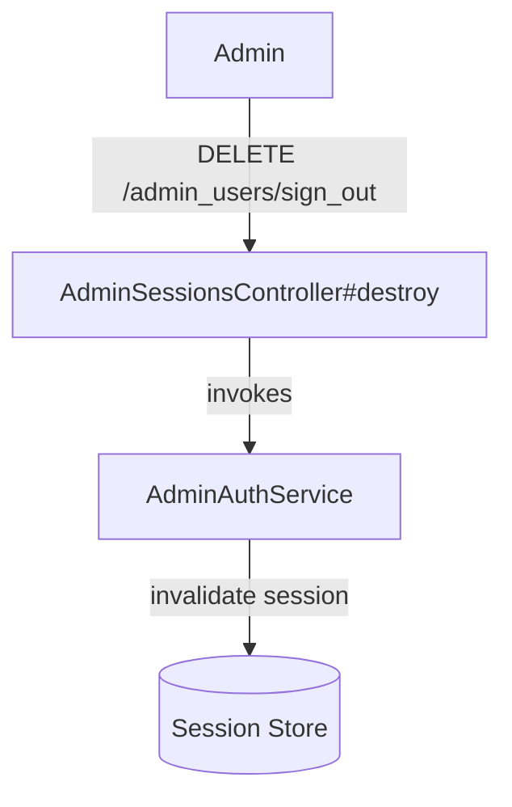

# SignOutAdmin — Capability Spec

**Bounded Context:** Identity & Profile
**Status:** planned
**Generated:** 2025-12-28T03:09:05.692Z
**Source:** `/Users/pcaplan/paul/cats-as-a-service/architecture/identity/architecture.json`

<!-- 
Status values:
  - template: Initial generated template, not yet planned
  - planned: Specs completed via /rampart.plan, ready for implementation
  - implemented: Code implementation complete
Update this status as you progress through the workflow.
-->

---

## Overview

Invalidate the admin's current session

**Actors:** Admin
**Entrypoints:** AdminSessionsController#destroy
**Outputs:** N/A

---

## Acceptance Criteria

<!-- Use EARS notation for testable requirements -->

### Happy Path

- [ ] WHEN an authenticated admin requests sign-out THE SYSTEM SHALL invalidate the current session
- [ ] WHEN sign-out succeeds THE SYSTEM SHALL clear the session cookie
- [ ] WHEN sign-out succeeds THE SYSTEM SHALL redirect to admin sign-in page

### Idempotency

- [ ] WHEN an unauthenticated guest requests sign-out THE SYSTEM SHALL redirect to sign-in page (no-op, idempotent)

---

## Error Handling

<!-- Define error scenarios using EARS IF/THEN notation -->

*Sign-out is inherently safe and idempotent. No error scenarios.*

---

## Domain State & Data

### Aggregates involved

**Aggregate:** AdminIdentity (read-only for session validation)

*Sign-out does not modify aggregate state — it only destroys the session.*

---

## Data Model

<!-- Map the Aggregate attributes above to a persistence schema -->
<!-- Note: Only model tables owned by this Bounded Context -->

*No schema changes required. Session is stored in cookies (Devise default) or Rails session store.*

---

## Request/Response Contracts

<!-- Define API payloads and Event DTOs -->

### Entrypoint

**DELETE /admin_users/sign_out**

### Request

No request body required. Session cookie identifies the admin.

```
DELETE /admin_users/sign_out
Cookie: _session_id=...
```

### Success Response

**HTTP 302 Found** — Redirect to admin sign-in

```
Location: /admin_users/sign_in
Set-Cookie: _session_id=; expires=...  (cleared)
```

---

## Architecture

### Capability Flow Diagram



### Application Layer

**Services:**
- AdminAuthService

### Domain Layer

**Aggregate:** AdminIdentity (not modified)

### Infrastructure Layer

**Ports Used:**
- None (session management is framework-level)

---

## Implementation Notes

### Devise Configuration

Sign-out is handled entirely by Devise's `SessionsController#destroy`:

```ruby
# AdminSessionsController
class AdminSessionsController < Devise::SessionsController
  # Default Devise behavior is sufficient for admin sign-out
  # Redirects to sign-in page after destroying session
end
```

### Session Storage

- Default: Cookie-based session (Devise default)
- Session is invalidated by clearing/expiring the cookie
- No server-side session store required for MVP

### CSRF Protection

- Ensure `DELETE /admin_users/sign_out` validates CSRF token
- Admin UI always uses browser-based requests with CSRF tokens

### Hexagonal Mapping

| Rampart Layer | Implementation |
|---------------|----------------|
| Controller | `AdminSessionsController#destroy` (inherits Devise) |
| Service | `AdminAuthService` (delegates to Devise) |

### Keeping It Simple

Since we're leaning on Devise:
- `Devise::SessionsController#destroy` handles session invalidation
- No custom overrides needed for admin sign-out
- Standard redirect to sign-in page

---

## ✅ Post-Implementation Checklist

Once implementation is complete:

- [ ] All acceptance criteria pass
- [ ] Error handling scenarios covered by tests
- [ ] Update **Status** field at top of this file from `planned` to `implemented`
