# Cat & Content — Architecture Diagrams

Generated from `/Users/pcaplan/paul/cats-as-a-service/architecture/cat_content/architecture.json` on 2025-12-28T03:18:15.142Z

---

## L1: System Context

---

## L3: Capability Flows

### BrowseCatalog

### GenerateCustomCat

### RefineCustomCat

### ManageCatalog

### ModerateCustomCats

