# Identity & Profile — Architecture Diagrams

Generated from `/Users/pcaplan/paul/cats-as-a-service/architecture/identity.json` on 2025-12-24T02:56:33.310Z

---

## L1: System Context

---

## L3: Capability Flows

### RegisterShopper

Create a new shopper account with email and password

### SignInShopper

Authenticate a shopper using email and password, establishing a session

### SignInShopperWithGoogle

Authenticate a shopper via Google OAuth; creates or links account automatically

### SignOutShopper

Invalidate the shopper's current session

### GetShopperSession

Return current authentication state and minimal profile for the Vercel frontend

### SignInAdmin

Authenticate an admin using username and password for the Rails admin UI

### SignOutAdmin

Invalidate the admin's current session

### ProvisionAdmin

Create a new admin account via server-side script; not exposed via web endpoints

