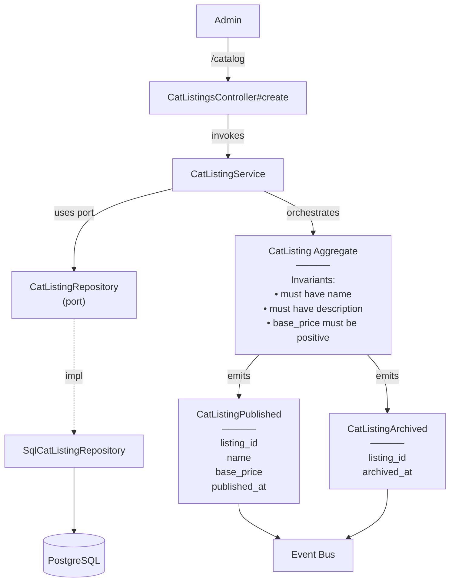

# ManageCatalog — Capability Spec

**Bounded Context:** Cat & Content
**Generated:** 2025-12-19T19:43:53.696Z
**Source:** `/Users/pcaplan/paul/cats-as-a-service/architecture/cat_content.json`

---

## Overview

**Actors:** Admin
**Entrypoints:** CatListingsController#create, CatListingsController#update, CatListingsController#publish, CatListingsController#archive
**Outputs:** CatListing

---

## Acceptance Criteria

<!-- Use EARS notation for testable requirements -->
<!-- WHEN <trigger> THE SYSTEM SHALL <response> -->
<!-- WHILE <state> THE SYSTEM SHALL <response> -->
<!-- IF <condition> THEN THE SYSTEM SHALL <response> -->

- [ ] WHEN ... THE SYSTEM SHALL ...
- [ ] WHEN ... THE SYSTEM SHALL ...
- [ ] WHEN ... THE SYSTEM SHALL ...

---

## Error Handling

<!-- Define error scenarios using EARS IF/THEN notation -->

- [ ] IF ... THEN THE SYSTEM SHALL ...
- [ ] IF ... THEN THE SYSTEM SHALL ...

---

## Architecture

### Capability Flow Diagram

### Application Layer

**Services:**
- CatListingService

### Domain Layer

**Aggregate:** CatListing

**Invariants:**
- must have name
- must have description
- base_price must be positive

**Lifecycle:** draft → published → archived

**Events Emitted:**
- CatListingPublished
- CatListingArchived

### Infrastructure Layer

**Ports Used:**
- CatListingRepository

**Adapters:**
- SqlCatListingRepository → CatListingRepository

---

## Data Model

<!-- Fill in during planning -->

### Schema

### Relationships

### Indexes

---

## Request/Response Contracts

<!-- Fill in during planning -->

---

## Implementation Notes (Optional)

<!-- Add any implementation-specific notes, constraints, or considerations -->
