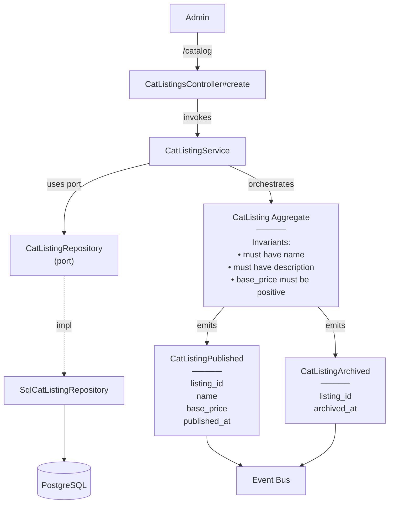

# ManageCatalog — Capability Spec

**Bounded Context:** Cat & Content
**Status:** planned
**Generated:** 2025-12-23T01:51:59.651Z
**Source:** `/Users/pcaplan/paul/cats-as-a-service/architecture/cat_content.json`

<!-- 
Status values:
  - template: Initial generated template, not yet planned
  - planned: Specs completed via /rampart.plan, ready for implementation
  - implemented: Code implementation complete
Update this status as you progress through the workflow.
-->

---

## Overview

**Actors:** Admin
**Entrypoints:** CatListingsController#create, CatListingsController#update, CatListingsController#publish, CatListingsController#archive
**Outputs:** CatListing

---

## Acceptance Criteria

<!-- Use EARS notation for testable requirements -->
<!-- WHEN <trigger> THE SYSTEM SHALL <response> -->
<!-- WHILE <state> THE SYSTEM SHALL <response> -->
<!-- IF <condition> THEN THE SYSTEM SHALL <response> -->

### Create Listing
- [ ] WHEN an admin submits valid listing data THE SYSTEM SHALL create a new CatListing in draft status
- [ ] WHEN a listing is created THE SYSTEM SHALL auto-generate a URL slug from the name
- [ ] WHERE name must be 1-100 characters
- [ ] WHERE description must be present
- [ ] WHERE price must be greater than or equal to 0

### Update Listing
- [ ] WHEN an admin updates a listing THE SYSTEM SHALL persist the changes
- [ ] WHEN the name changes THE SYSTEM SHALL regenerate the slug
- [ ] WHILE a listing is in any status (draft, published, archived) THE SYSTEM SHALL allow updates

### Publish Listing
- [ ] WHEN an admin publishes a draft listing THE SYSTEM SHALL change visibility to "published"
- [ ] WHEN a listing is published THE SYSTEM SHALL emit CatListingPublished event
- [ ] WHEN a listing is published THE SYSTEM SHALL make it visible in the public catalog

### Unpublish Listing
- [ ] WHEN an admin unpublishes a published listing THE SYSTEM SHALL change visibility to "private" (draft)
- [ ] WHEN a listing is unpublished THE SYSTEM SHALL remove it from the public catalog

### Archive Listing (Soft Delete)
- [ ] WHEN an admin archives a listing THE SYSTEM SHALL change visibility to "archived"
- [ ] WHEN a listing is archived THE SYSTEM SHALL emit CatListingArchived event
- [ ] WHEN a listing is archived THE SYSTEM SHALL remove it from the public catalog
- [ ] WHILE a listing is archived THE SYSTEM SHALL retain it in the database for admin viewing

### Image Upload
- [ ] WHEN an admin uploads an image THE SYSTEM SHALL store it in Vercel Blob storage
- [ ] WHEN an image is uploaded THE SYSTEM SHALL generate an immutable URL
- [ ] WHERE image files must be valid image formats (JPEG, PNG, WebP, GIF)

### Admin Listing View
- [ ] WHEN an admin views the listing index THE SYSTEM SHALL display all listings (draft, published, archived)
- [ ] WHEN an admin views a listing THE SYSTEM SHALL display all editable fields including age_months, temperament, and traits

---

## Error Handling

<!-- Define error scenarios using EARS IF/THEN notation -->

### Validation Errors
- [ ] IF name is blank THEN THE SYSTEM SHALL reject with error "Name is required"
- [ ] IF name exceeds 100 characters THEN THE SYSTEM SHALL reject with error "Name must be 100 characters or less"
- [ ] IF description is blank THEN THE SYSTEM SHALL reject with error "Description is required"
- [ ] IF price is negative THEN THE SYSTEM SHALL reject with error "Price must be zero or greater"
- [ ] IF slug conflicts with existing listing THEN THE SYSTEM SHALL append a numeric suffix to ensure uniqueness

### State Transition Errors
- [ ] IF admin attempts to publish an already published listing THEN THE SYSTEM SHALL display "Listing is already published"
- [ ] IF admin attempts to unpublish a draft listing THEN THE SYSTEM SHALL display "Listing is not published"
- [ ] IF admin attempts to archive an already archived listing THEN THE SYSTEM SHALL display "Listing is already archived"

### Upload Errors
- [ ] IF image upload fails THEN THE SYSTEM SHALL display "Image upload failed. Please try again."
- [ ] IF image format is invalid THEN THE SYSTEM SHALL reject with error "Invalid image format. Use JPEG, PNG, WebP, or GIF."
- [ ] IF image exceeds size limit THEN THE SYSTEM SHALL reject with error "Image too large. Maximum size is 4.5MB."

### Authorization Errors
- [ ] IF a non-admin user attempts any ManageCatalog action THEN THE SYSTEM SHALL redirect to login or display "Unauthorized"

---

## Domain State & Data

### Aggregates involved

#### CatListing
> Premade, curated, globally visible cat in the Cat-alog; root for catalog browsing

**Key Attributes:**
- `id`
- `name`
- `slug`
- `description`
- `price` (in cents)
- `currency`
- `visibility`
- `image_url`
- `image_alt`
- `tags`
- `age_months`
- `temperament`
- `traits`
- `created_at`
- `updated_at`

**Invariants:**
- must have name
- must have description
- price must be non-negative

**Lifecycle:** private (draft) -> published -> archived


### Domain Events Emitted

#### CatListingPublished
> Emitted when a premade cat becomes publicly visible

**Payload Intent:**
- `listing_id`
- `name`
- `base_price`
- `published_at`

#### CatListingArchived
> Emitted when a premade cat is removed from public view

**Payload Intent:**
- `listing_id`
- `archived_at`


---

## Data Model

<!-- Map the Aggregate attributes above to a persistence schema -->
<!-- Note: Only model tables owned by this Bounded Context -->

### Schema

| Table | Column | Type | Constraints |
|-------|--------|------|-------------|
| cat_content.cat_listings | id | UUID | PRIMARY KEY, DEFAULT gen_random_uuid() |
| cat_content.cat_listings | name | VARCHAR(100) | NOT NULL |
| cat_content.cat_listings | slug | VARCHAR(100) | NOT NULL, UNIQUE |
| cat_content.cat_listings | description | TEXT | NOT NULL |
| cat_content.cat_listings | price_cents | INTEGER | NOT NULL, >= 0 |
| cat_content.cat_listings | currency | VARCHAR(3) | DEFAULT 'USD' |
| cat_content.cat_listings | visibility | VARCHAR(20) | NOT NULL, DEFAULT 'private', IN ('private', 'published', 'archived') |
| cat_content.cat_listings | image_url | TEXT | NULL |
| cat_content.cat_listings | image_alt | TEXT | NULL |
| cat_content.cat_listings | tags | TEXT[] | DEFAULT '{}' |
| cat_content.cat_listings | age_months | INTEGER | NULL |
| cat_content.cat_listings | temperament | TEXT | NULL |
| cat_content.cat_listings | traits | TEXT[] | DEFAULT '{}' |
| cat_content.cat_listings | created_at | TIMESTAMP | DEFAULT CURRENT_TIMESTAMP |
| cat_content.cat_listings | updated_at | TIMESTAMP | DEFAULT CURRENT_TIMESTAMP |

### Relationships

No cross-aggregate references. CatListing is an independent aggregate root within the cat_content bounded context.

### Indexes

| Index Name | Columns | Type | Purpose |
|------------|---------|------|---------|
| idx_cat_listings_visibility | visibility | BTREE | Filter by status |
| idx_cat_listings_slug | slug | BTREE | Fast slug lookups |
| idx_cat_listings_tags | tags | GIN | Array filtering on tags |

**Notes:**
- Schema already exists in database (no migration needed)
- Visibility values: `private` (draft), `published`, `archived`

---

## Request/Response Contracts

<!-- Define API payloads and Event DTOs -->
<!-- Note: This capability uses Rails form-based views, not JSON API -->

### Form Submissions (Rails Views)

#### Create/Update Listing Form

**Strong Parameters:**
```ruby
params.require(:cat_listing).permit(
  :name,
  :description,
  :price_cents,
  :currency,
  :image,           # File upload
  :image_alt,
  :age_months,
  :temperament,
  tags: [],
  traits: []
)
```

#### Expected Fields

| Field | Type | Required | Notes |
|-------|------|----------|-------|
| name | string | Yes | 1-100 characters |
| description | text | Yes | Rich text or plain text |
| price_cents | integer | Yes | Price in cents (e.g., 1999 = $19.99) |
| currency | string | No | Default: "USD" |
| image | file | No | JPEG, PNG, WebP, GIF; max 4.5MB |
| image_alt | string | No | Alt text for accessibility |
| age_months | integer | No | Cat's age in months |
| temperament | string | No | e.g., "playful", "calm", "curious" |
| tags | array | No | Category tags |
| traits | array | No | Personality traits |

### Domain Events

#### CatListingPublished

```json
{
  "event_id": "uuid",
  "occurred_at": "2025-01-15T10:30:00Z",
  "schema_version": 1,
  "listing_id": "uuid",
  "name": "Whiskers the Magnificent",
  "base_price": 1999,
  "published_at": "2025-01-15T10:30:00Z"
}
```

#### CatListingArchived

```json
{
  "event_id": "uuid",
  "occurred_at": "2025-01-15T10:30:00Z",
  "schema_version": 1,
  "listing_id": "uuid",
  "archived_at": "2025-01-15T10:30:00Z"
}
```

---

## Architecture

### Capability Flow Diagram



### Application Layer

**Services:**
- CatListingService

### Domain Layer

**Aggregate:** CatListing

**Invariants:**
- must have name
- must have description
- base_price must be positive

**Lifecycle:** private (draft) → published → archived

**Aggregate Methods:**
- `publish()` — transitions to published
- `unpublish()` — transitions back to private
- `archive()` — transitions to archived
- `update_attributes(attrs)` — returns new instance with updated fields
- `published?()` — checks if visibility is published
- `draft?()` — checks if visibility is private
- `archived?()` — checks if visibility is archived

**Events Emitted:**
- CatListingPublished
- CatListingArchived

### Infrastructure Layer

**Ports Used:**
- CatListingRepository

**Adapters:**
- SqlCatListingRepository → CatListingRepository

---

## Implementation Notes (Optional)

### Rails Views (Not API)
- Admin interface uses standard Rails controller rendering ERB/HTML views
- Controller: `CatContent::Admin::CatListingsController` (not API-namespaced)
- Use Rails form helpers with `form_with` for create/update forms
- Flash messages for success/error feedback
- Admin authentication required before all actions

### Image Upload via Vercel Blob
- Use `@vercel/blob` SDK or direct HTTP API for uploads
- Store returned immutable URL in `image_url` column
- Server uploads limited to 4.5MB (use client-side upload for larger files if needed)
- Port: `ImageStoragePort` with adapter `VercelBlobImageAdapter`
- Store only the final immutable URL; original uploaded file is not needed

### Slug Generation
- Generate from name using Rails `parameterize` method (e.g., "Whiskers the Cat" → "whiskers-the-cat")
- On conflict, append numeric suffix (e.g., "whiskers-the-cat-2")
- Regenerate slug automatically when name is updated
- Slug must remain stable for published listings (to avoid breaking URLs in commerce context)

### Aggregate Methods to Add
- `unpublish` — returns listing to `private` visibility
- `update_attributes(attrs)` — returns new instance with updated fields

### Service Methods to Add to CatListingService
- `create(command)` — create new draft listing, return Success/Failure
- `update(id, command)` — update listing attributes, return Success/Failure
- `publish(id)` — transition to published, emit event, return Success/Failure
- `unpublish(id)` — transition back to private, return Success/Failure
- `archive(id)` — soft delete, emit event, return Success/Failure
- `list_all` — return all listings for admin view
- `find(id)` — find listing by id for admin view

### Event Publishing
- `CatListingPublished` emitted when listing transitions to published state
- `CatListingArchived` emitted when listing is archived
- Events include timestamp (occurred_at) for audit trail
- Events published via existing EventBus infrastructure

---

## ✅ Post-Implementation Checklist

Once implementation is complete:

- [ ] All acceptance criteria pass
- [ ] Error handling scenarios covered by tests
- [ ] Update **Status** field at top of this file from `planned` to `implemented`
