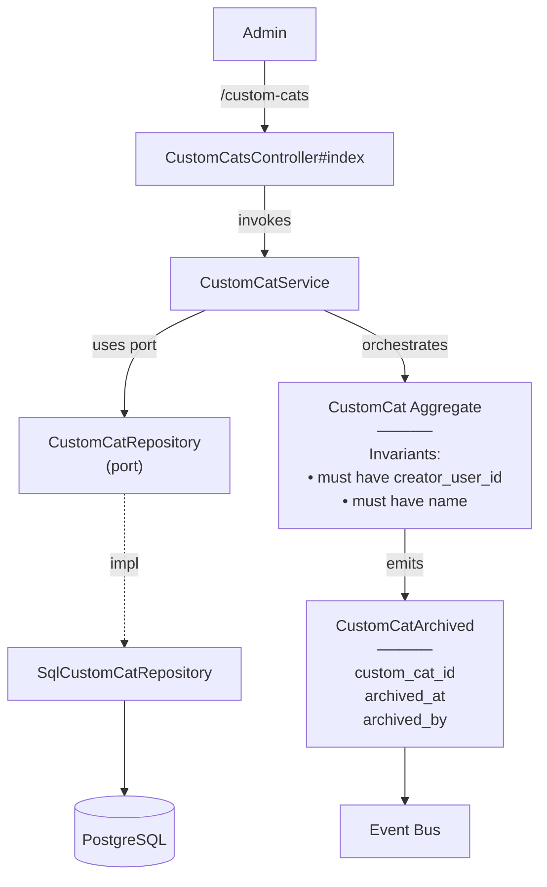

# ModerateCustomCats — Capability Spec

**Bounded Context:** Cat & Content
**Generated:** 2025-12-19T19:43:53.696Z
**Source:** `/Users/pcaplan/paul/cats-as-a-service/architecture/cat_content.json`

---

## Overview

**Actors:** Admin
**Entrypoints:** CustomCatsController#index, CustomCatsController#archive
**Outputs:** N/A

---

## Acceptance Criteria

<!-- Use EARS notation for testable requirements -->
<!-- WHEN <trigger> THE SYSTEM SHALL <response> -->
<!-- WHILE <state> THE SYSTEM SHALL <response> -->
<!-- IF <condition> THEN THE SYSTEM SHALL <response> -->

- [ ] WHEN ... THE SYSTEM SHALL ...
- [ ] WHEN ... THE SYSTEM SHALL ...
- [ ] WHEN ... THE SYSTEM SHALL ...

---

## Error Handling

<!-- Define error scenarios using EARS IF/THEN notation -->

- [ ] IF ... THEN THE SYSTEM SHALL ...
- [ ] IF ... THEN THE SYSTEM SHALL ...

---

## Architecture

### Capability Flow Diagram

### Application Layer

**Services:**
- CustomCatService

### Domain Layer

**Aggregate:** CustomCat

**Invariants:**
- must have creator_user_id
- must have name

**Lifecycle:** generating → active → archived

**Events Emitted:**
- CustomCatArchived

### Infrastructure Layer

**Ports Used:**
- CustomCatRepository

**Adapters:**
- SqlCustomCatRepository → CustomCatRepository

---

## Data Model

<!-- Fill in during planning -->

### Schema

### Relationships

### Indexes

---

## Request/Response Contracts

<!-- Fill in during planning -->

---

## Implementation Notes (Optional)

<!-- Add any implementation-specific notes, constraints, or considerations -->
