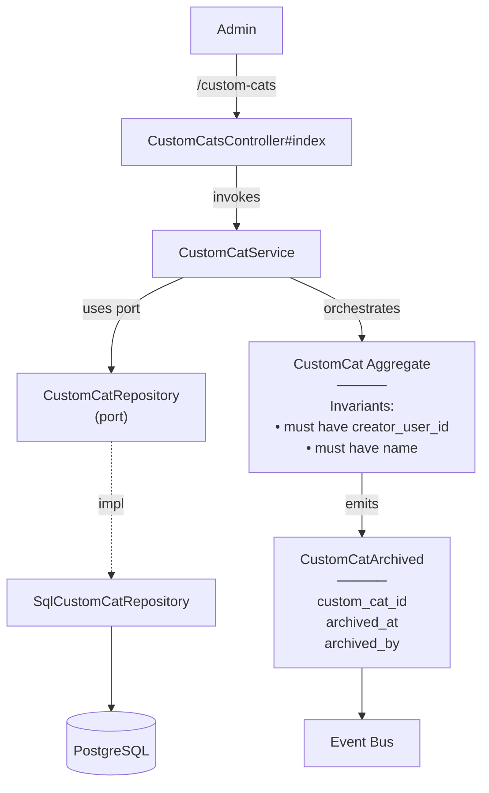

# ModerateCustomCats — Capability Spec

**Bounded Context:** Cat & Content
**Generated:** 2025-12-19T21:53:31.838Z
**Source:** `/Users/pcaplan/paul/cats-as-a-service/architecture/cat_content.json`

---

## Overview

**Actors:** Admin
**Entrypoints:** CustomCatsController#index, CustomCatsController#archive
**Outputs:** N/A

---

## Acceptance Criteria

<!-- Use EARS notation for testable requirements -->
<!-- WHEN <trigger> THE SYSTEM SHALL <response> -->
<!-- WHILE <state> THE SYSTEM SHALL <response> -->
<!-- IF <condition> THEN THE SYSTEM SHALL <response> -->

- [ ] WHEN ... THE SYSTEM SHALL ...
- [ ] WHEN ... THE SYSTEM SHALL ...
- [ ] WHEN ... THE SYSTEM SHALL ...

---

## Error Handling

<!-- Define error scenarios using EARS IF/THEN notation -->

- [ ] IF ... THEN THE SYSTEM SHALL ...
- [ ] IF ... THEN THE SYSTEM SHALL ...

---

## Domain State & Data

### Aggregates involved

#### CustomCat
> User-specific, AI-generated cat record; root for user's created cats

**Key Attributes:**
- `id`
- `name`
- `description`
- `image_url`
- `creator_user_id`

**Invariants:**
- must have creator_user_id
- must have name

**Lifecycle:** generating -> active -> archived


### Domain Events Emitted

#### CustomCatArchived
> Emitted when a user archives their custom cat

**Payload Intent:**
- `custom_cat_id`
- `archived_at`
- `archived_by`


---

## Data Model

<!-- Map the Aggregate attributes above to a persistence schema -->
<!-- Note: Only model tables owned by this Bounded Context -->

| Table | Column | Type | Constraints |
|-------|--------|------|-------------|
| ...   | ...    | ...  | ...         |

---

## Request/Response Contracts

<!-- Define API payloads and Event DTOs -->
<!-- Tip: Use Task-Based naming (e.g. GenerateCustomCatRequest) -->

```json
// Request
{
  ...
}
```

---

## Architecture

### Capability Flow Diagram



### Application Layer

**Services:**
- CustomCatService

### Domain Layer

**Aggregate:** CustomCat

**Invariants:**
- must have creator_user_id
- must have name

**Lifecycle:** generating → active → archived

**Events Emitted:**
- CustomCatArchived

### Infrastructure Layer

**Ports Used:**
- CustomCatRepository

**Adapters:**
- SqlCustomCatRepository → CustomCatRepository

---

## Data Model

<!-- Fill in during planning -->

### Schema

### Relationships

### Indexes

---

## Request/Response Contracts

<!-- Fill in during planning -->

---

## Implementation Notes (Optional)

<!-- Add any implementation-specific notes, constraints, or considerations -->
