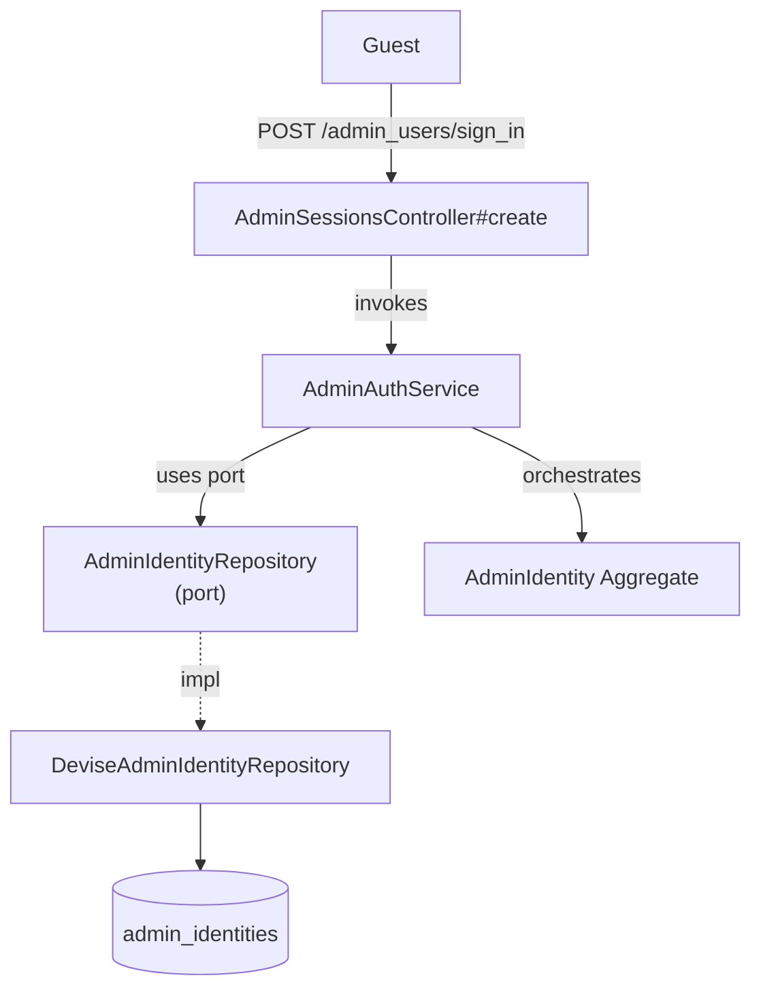

# SignInAdmin — Capability Spec

**Bounded Context:** Identity & Profile
**Status:** planned
**Generated:** 2025-12-28T03:09:05.692Z
**Source:** `/Users/pcaplan/paul/cats-as-a-service/architecture/identity.json`

<!-- 
Status values:
  - template: Initial generated template, not yet planned
  - planned: Specs completed via /rampart.plan, ready for implementation
  - implemented: Code implementation complete
Update this status as you progress through the workflow.
-->

---

## Overview

Authenticate an admin using username and password for the Rails admin UI

**Actors:** Guest
**Entrypoints:** AdminSessionsController#create
**Outputs:** AdminIdentity

---

## Acceptance Criteria

<!-- Use EARS notation for testable requirements -->

### Happy Path

- [ ] WHEN a guest submits valid credentials (username, password) THE SYSTEM SHALL authenticate the admin via AdminIdentityRepository
- [ ] WHEN authentication succeeds THE SYSTEM SHALL establish a session (set session cookie)
- [ ] WHEN authentication succeeds THE SYSTEM SHALL redirect to admin dashboard
- [ ] WHERE session expires after 30 minutes of inactivity

### Account States

- [ ] WHEN an admin with status='active' signs in successfully THE SYSTEM SHALL establish the session
- [ ] WHEN an admin with status='locked' attempts to sign in THE SYSTEM SHALL reject with error "Your account is locked"

### Account Locking (Brute Force Protection)

- [ ] WHEN an admin fails authentication 5 times consecutively THE SYSTEM SHALL lock the account
- [ ] WHILE an account is locked THE SYSTEM SHALL reject sign-in with error "Your account is locked due to too many failed attempts. Please try again in 1 hour."
- [ ] WHEN 1 hour has elapsed since account lock THE SYSTEM SHALL automatically unlock the account
- [ ] WHEN an admin signs in successfully THE SYSTEM SHALL reset the failed attempt counter

---

## Error Handling

<!-- Define error scenarios using EARS IF/THEN notation -->

### Authentication Errors

- [ ] IF username does not exist THEN THE SYSTEM SHALL reject with error "Invalid username or password"
- [ ] IF password is incorrect THEN THE SYSTEM SHALL reject with error "Invalid username or password"
- [ ] IF username is missing THEN THE SYSTEM SHALL reject with error "Invalid username or password"
- [ ] IF password is missing THEN THE SYSTEM SHALL reject with error "Invalid username or password"

### Account State Errors

- [ ] IF account status is 'locked' THEN THE SYSTEM SHALL reject with error "Your account is locked"

### Rate Limiting

- [ ] IF a client exceeds 5 sign-in attempts per minute THEN THE SYSTEM SHALL reject with HTTP 429 and error "Too many requests. Please try again later."

---

## Domain State & Data

### Aggregates involved

**Aggregate:** AdminIdentity

**Key Attributes:** id, username, encrypted_password, status, failed_attempts, locked_at

**Invariants:**
- username must be present and unique
- password must meet minimum strength requirements (12+ chars)
- can only be created via server-side script

**Lifecycle:** active → locked

---

## Data Model

<!-- Map the Aggregate attributes above to a persistence schema -->
<!-- Note: Only model tables owned by this Bounded Context -->

### Schema

| Table | Column | Type | Constraints |
|-------|--------|------|-------------|
| admin_identities | id | uuid | PRIMARY KEY, DEFAULT gen_random_uuid() |
| admin_identities | username | string(100) | NOT NULL, UNIQUE |
| admin_identities | encrypted_password | string(255) | NOT NULL |
| admin_identities | status | string(20) | NOT NULL, DEFAULT 'active' |
| admin_identities | failed_attempts | integer | NOT NULL, DEFAULT 0 |
| admin_identities | locked_at | timestamp | NULL |
| admin_identities | created_at | timestamp | NOT NULL |
| admin_identities | updated_at | timestamp | NOT NULL |

### Relationships

None — AdminIdentity is a standalone aggregate.

### Indexes

| Index Name | Columns | Type | Purpose |
|------------|---------|------|---------|
| index_admin_identities_on_username | username | UNIQUE | Enforce uniqueness, fast lookup |

### Enums

| Column | Values | Notes |
|--------|--------|-------|
| status | active, locked | Lifecycle states |

---

## Request/Response Contracts

<!-- Define API payloads and Event DTOs -->

### Entrypoint

**POST /admin_users/sign_in**

### Request

```
POST /admin_users/sign_in
Content-Type: application/x-www-form-urlencoded

admin_user[username]=admin
admin_user[password]=securepassword123
```

*Note: Admin UI uses form submission, not JSON API.*

| Field | Type | Required | Notes |
|-------|------|----------|-------|
| username | string | Yes | Case-sensitive |
| password | string | Yes | Verified against encrypted_password |

### Success Response

**HTTP 302 Found** — Redirect to admin dashboard

```
Location: /admin
Set-Cookie: _session_id=...
```

### Error Responses

**HTTP 200 OK** (re-render form with error)

```html
<div class="alert">Invalid username or password</div>
```

**HTTP 200 OK** (account locked)

```html
<div class="alert">Your account is locked due to too many failed attempts. Please try again in 1 hour.</div>
```

**HTTP 429 Too Many Requests**

```html
<div class="alert">Too many requests. Please try again later.</div>
```

---

## Architecture

### Capability Flow Diagram



### Application Layer

**Services:**
- AdminAuthService

### Domain Layer

**Aggregate:** AdminIdentity

**Invariants:**
- username must be present and unique
- password must meet minimum strength requirements (12+ chars)
- can only be created via server-side script

**Lifecycle:** active → locked

### Infrastructure Layer

**Ports Used:**
- AdminIdentityRepository

**Adapters:**
- DeviseAdminIdentityRepository → AdminIdentityRepository

---

## Implementation Notes

### Devise Configuration

```ruby
# AdminIdentity model
class AdminIdentity < ApplicationRecord
  devise :database_authenticatable, :lockable, :timeoutable
  
  # Use username instead of email
  def self.find_for_database_authentication(warden_conditions)
    where(username: warden_conditions[:username]).first
  end
end
```

### Lockable Settings

```ruby
# config/initializers/devise.rb (admin scope)
config.lock_strategy = :failed_attempts
config.unlock_strategy = :time
config.maximum_attempts = 5
config.unlock_in = 1.hour
```

### Session Timeout (30 minutes)

```ruby
# config/initializers/devise.rb (admin scope)
config.timeout_in = 30.minutes
```

### Authentication Key

```ruby
# config/initializers/devise.rb
Devise.setup do |config|
  config.authentication_keys = [:username]  # for AdminIdentity scope
end
```

### Rate Limiting

- Use Rack::Attack or similar middleware
- Throttle by IP: 5 requests/minute to `POST /admin_users/sign_in`

### Hexagonal Mapping

| Rampart Layer | Implementation |
|---------------|----------------|
| Controller | `AdminSessionsController` (inherits Devise) |
| Service | `AdminAuthService` (thin wrapper) |
| Repository Port | `AdminIdentityRepository` |
| Repository Adapter | `DeviseAdminIdentityRepository` |
| Aggregate | `AdminIdentity` (Devise model) |

---

## ✅ Post-Implementation Checklist

Once implementation is complete:

- [ ] All acceptance criteria pass
- [ ] Error handling scenarios covered by tests
- [ ] Update **Status** field at top of this file from `planned` to `implemented`
