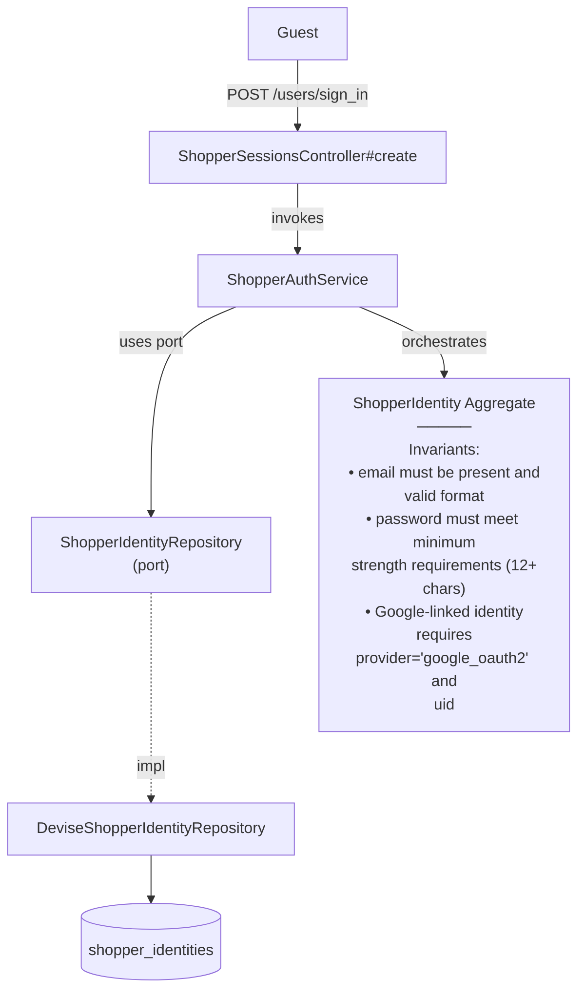

# SignInShopper — Capability Spec

**Bounded Context:** Identity & Profile
**Status:** planned
**Generated:** 2025-12-28T03:09:05.692Z
**Source:** `/Users/pcaplan/paul/cats-as-a-service/architecture/identity.json`

<!-- 
Status values:
  - template: Initial generated template, not yet planned
  - planned: Specs completed via /rampart.plan, ready for implementation
  - implemented: Code implementation complete
Update this status as you progress through the workflow.
-->

---

## Overview

Authenticate a shopper using email and password, establishing a session

**Actors:** Guest
**Entrypoints:** ShopperSessionsController#create
**Outputs:** ShopperIdentity

---

## Acceptance Criteria

<!-- Use EARS notation for testable requirements -->

### Happy Path

- [ ] WHEN a guest submits valid credentials (email, password) THE SYSTEM SHALL authenticate the shopper via ShopperIdentityRepository
- [ ] WHEN authentication succeeds THE SYSTEM SHALL establish a session (set session cookie)
- [ ] WHEN authentication succeeds THE SYSTEM SHALL return the authenticated ShopperIdentity
- [ ] WHERE session expires after 24 hours of inactivity

### Account States

- [ ] WHEN a shopper with status='active' signs in successfully THE SYSTEM SHALL establish the session
- [ ] WHEN a shopper with status='suspended' attempts to sign in THE SYSTEM SHALL reject with error "Your account has been suspended"

### Account Locking (Brute Force Protection)

- [ ] WHEN a shopper fails authentication 5 times consecutively THE SYSTEM SHALL lock the account
- [ ] WHILE an account is locked THE SYSTEM SHALL reject sign-in with error "Your account is locked due to too many failed attempts. Please try again in 1 hour."
- [ ] WHEN 1 hour has elapsed since account lock THE SYSTEM SHALL automatically unlock the account
- [ ] WHEN a shopper signs in successfully THE SYSTEM SHALL reset the failed attempt counter

---

## Error Handling

<!-- Define error scenarios using EARS IF/THEN notation -->

### Authentication Errors

- [ ] IF email does not exist THEN THE SYSTEM SHALL reject with error "Invalid email or password"
- [ ] IF password is incorrect THEN THE SYSTEM SHALL reject with error "Invalid email or password"
- [ ] IF email is missing THEN THE SYSTEM SHALL reject with error "Invalid email or password"
- [ ] IF password is missing THEN THE SYSTEM SHALL reject with error "Invalid email or password"

### Account State Errors

- [ ] IF account status is 'suspended' THEN THE SYSTEM SHALL reject with error "Your account has been suspended"
- [ ] IF account is locked THEN THE SYSTEM SHALL reject with error "Your account is locked due to too many failed attempts. Please try again in 1 hour."

### Rate Limiting

- [ ] IF a client exceeds 5 sign-in attempts per minute THEN THE SYSTEM SHALL reject with HTTP 429 and error "Too many requests. Please try again later."

---

## Domain State & Data

### Aggregates involved

**Aggregate:** ShopperIdentity

**Key Attributes:** id, email, encrypted_password, name, provider, uid, email_verified, status, failed_attempts, locked_at

**Invariants:**
- email must be present and valid format
- password must meet minimum strength requirements (12+ chars)
- Google-linked identity requires provider='google_oauth2' and uid

**Lifecycle:** active → suspended

---

## Data Model

<!-- Map the Aggregate attributes above to a persistence schema -->
<!-- Note: Only model tables owned by this Bounded Context -->

### Schema (Additional columns for Lockable)

| Table | Column | Type | Constraints | Notes |
|-------|--------|------|-------------|-------|
| shopper_identities | failed_attempts | integer | NOT NULL, DEFAULT 0 | Devise :lockable |
| shopper_identities | locked_at | timestamp | NULL | Devise :lockable |

*Note: Base schema defined in RegisterShopper spec. These are additional columns for the lockable feature.*

### Relationships

None — ShopperIdentity is a standalone aggregate.

### Indexes

No additional indexes required for sign-in (email lookup index defined in RegisterShopper).

---

## Request/Response Contracts

<!-- Define API payloads and Event DTOs -->

### Entrypoint

**POST /users/sign_in**

### Request

```json
{
  "user": {
    "email": "shopper@example.com",
    "password": "securepassword123"
  }
}
```

| Field | Type | Required | Notes |
|-------|------|----------|-------|
| email | string | Yes | Case-insensitive lookup |
| password | string | Yes | Verified against encrypted_password |

### Success Response

**HTTP 200 OK**

```json
{
  "id": "550e8400-e29b-41d4-a716-446655440000",
  "email": "shopper@example.com",
  "name": "Jane Doe",
  "email_verified": false,
  "created_at": "2025-12-28T12:00:00Z"
}
```

*Note: Session cookie is set automatically by Devise.*

### Error Responses

**HTTP 401 Unauthorized** (invalid credentials)

```json
{
  "error": "Invalid email or password"
}
```

**HTTP 401 Unauthorized** (account suspended)

```json
{
  "error": "Your account has been suspended"
}
```

**HTTP 401 Unauthorized** (account locked)

```json
{
  "error": "Your account is locked due to too many failed attempts. Please try again in 1 hour."
}
```

**HTTP 429 Too Many Requests**

```json
{
  "error": "Too many requests. Please try again later."
}
```

---

## Architecture

### Capability Flow Diagram



### Application Layer

**Services:**
- ShopperAuthService

### Domain Layer

**Aggregate:** ShopperIdentity

**Invariants:**
- email must be present and valid format
- password must meet minimum strength requirements (12+ chars)
- Google-linked identity requires provider='google_oauth2' and uid

**Lifecycle:** active → suspended

### Infrastructure Layer

**Ports Used:**
- ShopperIdentityRepository

**Adapters:**
- DeviseShopperIdentityRepository → ShopperIdentityRepository

---

## Implementation Notes

### Devise Configuration

- Use Devise modules: `:database_authenticatable`, `:lockable`
- Do NOT enable `:rememberable` (no persistent sessions)
- Override `Devise::SessionsController` with `ShopperSessionsController`

### Lockable Settings

```ruby
# config/initializers/devise.rb
config.lock_strategy = :failed_attempts
config.unlock_strategy = :time
config.maximum_attempts = 5
config.unlock_in = 1.hour
```

### Session Timeout

```ruby
# config/initializers/devise.rb
config.timeout_in = 24.hours
```

*Note: Requires `:timeoutable` module for automatic session expiry.*

### Custom Error Messages

Override Devise's failure responses in `ShopperSessionsController`:
- Check for `resource.suspended?` → return suspended message
- Check for `resource.access_locked?` → return locked message
- Otherwise → return generic "Invalid email or password"

### Rate Limiting

- Use Rack::Attack or similar middleware
- Throttle by IP: 5 requests/minute to `POST /users/sign_in`

### Hexagonal Mapping

| Rampart Layer | Implementation |
|---------------|----------------|
| Controller | `ShopperSessionsController` (inherits Devise) |
| Service | `ShopperAuthService` (thin wrapper, delegates to Devise) |
| Repository Port | `ShopperIdentityRepository` |
| Repository Adapter | `DeviseShopperIdentityRepository` (wraps Devise model) |
| Aggregate | `ShopperIdentity` (Devise model) |

### Keeping It Simple

Since we're leaning on Devise:
- `warden.authenticate!` handles credential verification
- `:lockable` module tracks failed attempts and auto-locks
- `:timeoutable` module handles session expiry
- Controller overrides only needed for JSON responses and custom error messages

---

## ✅ Post-Implementation Checklist

Once implementation is complete:

- [ ] All acceptance criteria pass
- [ ] Error handling scenarios covered by tests
- [ ] Update **Status** field at top of this file from `planned` to `implemented`
